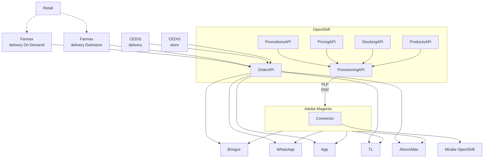

```mermaid


flowchart  TB

    Retail 
    FramaxDOM[Farmax <br> delivery On Demand]
    FramaxDS[Farmax <br> delivery Darkstore]
    CEDISD[CEDIS <br> delivery]
    CEDISS[CEDIS <br> store]
    OrderAPI
    PA[ProvisioningAPI]

    Retail e1@--> FramaxDOM
    Retail a1@--> FramaxDS
    FramaxDOM --> OrderAPI
    FramaxDS --> OrderAPI
    CEDISD --> OrderAPI
    CEDISS-->OrderAPI
        subgraph Magento [Adobe Magento]
        Connector
    end
    subgraph OpenShift 
        OrderAPI
        PromotionsAPI -->PA
        PricingAPI-->PA
        StockingAPI-->PA
        ProductsAPI-->PA
    end

    PA -->|PLP<br>PDP| Magento
    
    Connector --> Mirakl[Mirake OpenShift]
    Magento --> Bringoz
    Magento --> WhatsApp
    Magento --> App
    Magento --> TL
    Magento --> AhorroMax
    OrderAPI --> Bringoz
    OrderAPI --> WhatsApp
    OrderAPI --> App
    OrderAPI --> TL
    OrderAPI --> AhorroMax


  e1@{ animation: slow }
 a1@{ animation: slow  }

```
