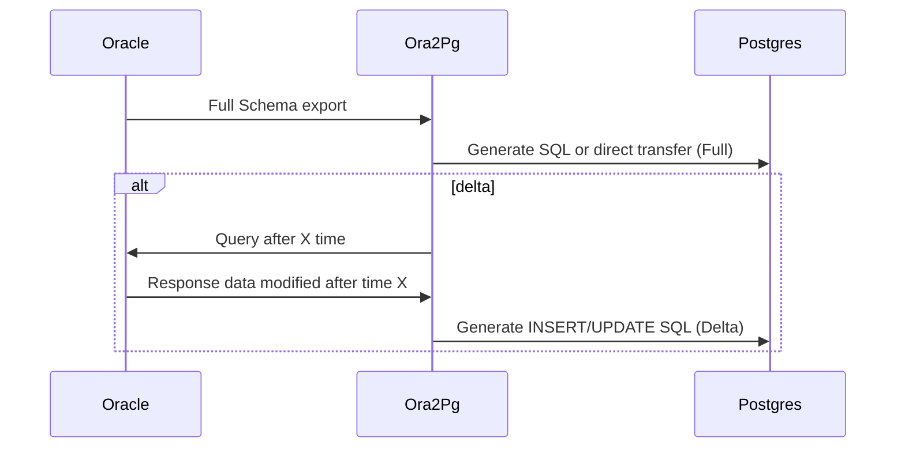

### Data Migration

```mermaid

sequenceDiagram
    participant Oracle
    participant Ora2Pg
    participant Postgres

    Oracle->>Ora2Pg: Full Schema export
    Ora2Pg->>Postgres: Generate SQL or direct transfer (Full)
    
    alt delta
        Ora2Pg->>Oracle: Query after X time
        Oracle->>Ora2Pg: Response data modified after time X
        Ora2Pg->>Postgres: Generate INSERT/UPDATE SQL (Delta)
    end


```
